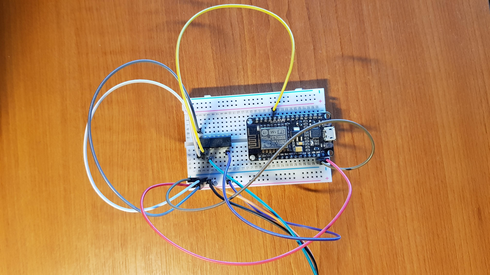
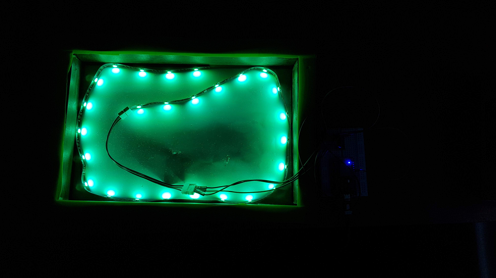

## Inspiration

[Nanoleaf](https://nanoleaf.me/). It's hard not to have heard of, or atleast seen, their flagship products. Featured heavily Pinterest board; in the background of Youtube videos. The smart wall panel caught my eye, and so I checked out their page to possibly buy one. I looked at the price. I looked at my student bank account. I looked back at the price. Buying one at the time wasn't a possiblity, but what about making one?

## Research

So. Much. Research. I could now tell you more about the WS2812B LED's than I would like to admit. I knew before I got to the design stage, I would have to do research about the components I would need. I found a couple of videos on Youtube that gave
me some inspiration and some help in this department. I ended up going with:

- ESP8266 microcontroller
- WS2812B LED strip
- Breadboard
- Logic Level shifter

## Software

Having the LED's connected up to the controller is one thing, but they're useless without any software to control them. Thankfully, [WLED](https://github.com/Aircoookie/WLED) had my back. A feature rich, open-source web server for the ESP8266 to allow smart control of attached LED strips. It has hundreds of effects, easy to use, and is highly customisable.

Adding the software onto the controller was relatively easy. Apart from the hickup of Windows drivers not working initially, the Arduino IDE made it easy for me to select the settings required for the device. You should research what these settings are for your device.

**Edit:** It seems as though WLED now recommends using [ESPTool](https://github.com/espressif/esptool) instead to flash the binary.

## Design

This is the stage that I am at currently. Trying to complete this project between my university deadlines whilst being a final year student is not easy. But progress is being made.

The initial thought was to use a pre-designed 3D-printed model I found that replicated the haxagon nature of the Nanoleaf. However, I thought this would look to similar, and I wanted it to have my own personal flair to it.

Therefore, the current idea is to buy some timer, wood glue, and clamps, and create a hexagon myself. This would allow me to improve my woodworking skills, whilst adding the natural appeal of wood instead of plastic filament.
